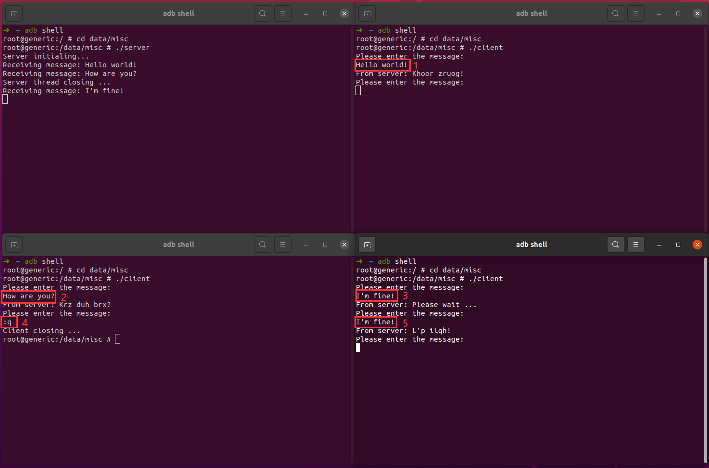

# Problem 4

Please see the source code in `./jni/server.c` and `./jni/client.c`.

Type `ndk-build` in shell in `./jni` folder, and you will get two executable files in `./libs/armeabi`, `server` and `client`.

Here are some screenshots of the running results:
